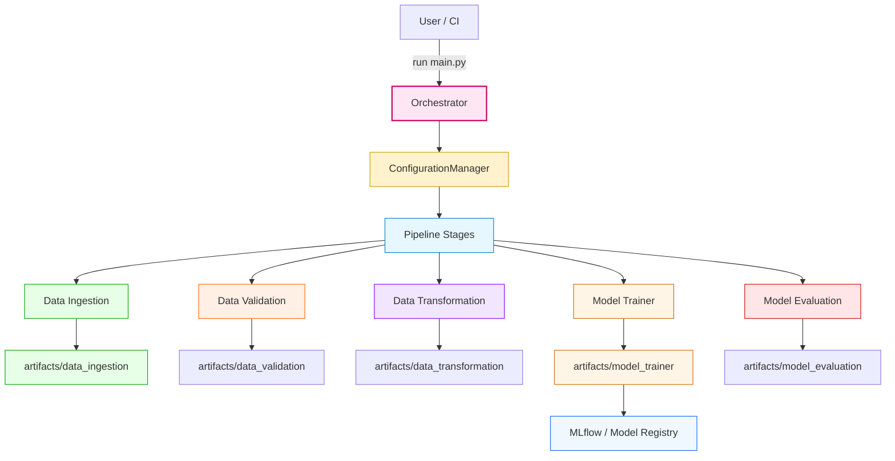

# 🚀 MLOps DataScience Pipeline

[](https://www.python.org/)
[](LICENSE)
[]()

A colorful, modular, YAML-driven end-to-end MLOps pipeline in Python covering:
Data Ingestion → Validation → Transformation → Model Training → Evaluation (MLflow).  
All artifacts are written to `artifacts/` for reproducibility.

---

## ✨ Quick links
- Config: `config/config.yaml`  
- Params: `params.yaml`  
- Schema: `schema.yaml`  
- Run: `python main.py`

---

## 🧭 Architecture (visual)
Mermaid diagram — nodes colored for clarity.



> If Mermaid does not render in your viewer, the plaintext pipeline is described below.

---

## 📦 Pipeline stages (plaintext)
1. Data Ingestion — download & extract → artifacts/data_ingestion  
2. Data Validation — schema & column checks → artifacts/data_validation/status.txt  
3. Data Transformation — feature work & split → artifacts/data_transformation/train.csv, test.csv  
4. Model Trainer — train & save model → artifacts/model_trainer/<model>  
5. Model Evaluation — compute metrics & log to MLflow → artifacts/model_evaluation & MLflow

---

## 🛠 Quick start (Windows)
1. Create & activate venv (PowerShell)
```powershell
python -m venv venv
.\venv\Scripts\Activate.ps1
pip install -r requirements.txt
```
2. Verify config files exist (root): `config/config.yaml`, `params.yaml`, `schema.yaml`  
3. Run:
```cmd
python main.py
```

---

## ⚠️ Common gotchas
- YAML: use a space after colon — `key: value` (no `key:value`).  
- Config keys are case-sensitive and must match code (e.g., `alpha` not `aplha`).  
- If you see `ConfigBox object has no attribute 'X'` — open the YAML and fix key name/case.  
- `TypeError: 'DataFrame' object is not callable` → use `df[col]`, not `df(col)`.

---

## 🔍 Debug tips
```python
from src.mlops_pipeline.utils.common import read_yaml
print(read_yaml("config/config.yaml"))
print(read_yaml("params.yaml"))
print(read_yaml("schema.yaml"))
```
List CSVs produced:
```python
from pathlib import Path
print(list(Path("artifacts/data_ingestion").glob("*.csv")))
```

---

## 📁 Project layout (high-level)
- main.py — orchestrator  
- config/ — pipeline configuration  
- params.yaml — hyperparameters  
- schema.yaml — dataset schema  
- src/mlops_pipeline/
  - config/ ConfigurationManager
  - pipeline/ stage pipelines
  - components/ step implementations
  - entity/ dataclasses
  - utils/ helpers
- research/ — notebooks  
- artifacts/ — outputs

---

## ✅ Next suggestions
- Add unit tests & CI.  
- Harden config parsing with defaults.  
- Add MLflow server/registry and Docker + CI for reproducible runs.  
- Add a PNG or SVG export of the architecture under `docs/` for viewers that don't render Mermaid.

---

If you want I can:
- generate a PNG/SVG architecture diagram (I will provide the Mermaid export steps), or
- add project badges (build, coverage) — tell me your CI/service names.
```// filepath: c:\Users\pc\Desktop\ai\mlops-datascience\README.md
# 🚀 MLOps DataScience Pipeline

[](https://www.python.org/)
[](LICENSE)
[]()

A colorful, modular, YAML-driven end-to-end MLOps pipeline in Python covering:
Data Ingestion → Validation → Transformation → Model Training → Evaluation (MLflow).  
All artifacts are written to `artifacts/` for reproducibility.

---

## ✨ Quick links
- Config: `config/config.yaml`  
- Params: `params.yaml`  
- Schema: `schema.yaml`  
- Run: `python main.py`

---

## 🧭 Architecture (visual)
Mermaid diagram — nodes colored for clarity.


> If Mermaid does not render in your viewer, the plaintext pipeline is described below.

---

## 📦 Pipeline stages (plaintext)
1. Data Ingestion — download & extract → artifacts/data_ingestion  
2. Data Validation — schema & column checks → artifacts/data_validation/status.txt  
3. Data Transformation — feature work & split → artifacts/data_transformation/train.csv, test.csv  
4. Model Trainer — train & save model → artifacts/model_trainer/<model>  
5. Model Evaluation — compute metrics & log to MLflow → artifacts/model_evaluation & MLflow

---

## 🛠 Quick start (Windows)
1. Create & activate venv (PowerShell)
```powershell
python -m venv venv
.\venv\Scripts\Activate.ps1
pip install -r requirements.txt
```
2. Verify config files exist (root): `config/config.yaml`, `params.yaml`, `schema.yaml`  
3. Run:
```cmd
python main.py
```

---

## ⚠️ Common gotchas
- YAML: use a space after colon — `key: value` (no `key:value`).  
- Config keys are case-sensitive and must match code (e.g., `alpha` not `aplha`).  
- If you see `ConfigBox object has no attribute 'X'` — open the YAML and fix key name/case.  
- `TypeError: 'DataFrame' object is not callable` → use `df[col]`, not `df(col)`.

---

## 🔍 Debug tips
```python
from src.mlops_pipeline.utils.common import read_yaml
print(read_yaml("config/config.yaml"))
print(read_yaml("params.yaml"))
print(read_yaml("schema.yaml"))
```
List CSVs produced:
```python
from pathlib import Path
print(list(Path("artifacts/data_ingestion").glob("*.csv")))
```

---

## 📁 Project layout (high-level)
- main.py — orchestrator  
- config/ — pipeline configuration  
- params.yaml — hyperparameters  
- schema.yaml — dataset schema  
- src/mlops_pipeline/
  - config/ ConfigurationManager
  - pipeline/ stage pipelines
  - components/ step implementations
  - entity/ dataclasses
  - utils/ helpers
- research/ — notebooks  
- artifacts/ — outputs

---

## ✅ Next suggestions
- Add unit tests & CI.  
- Harden config parsing with defaults.  
- Add MLflow server/registry and Docker + CI for reproducible runs.  
- Add a PNG or SVG export of the architecture under `docs/` for viewers that don't render Mermaid.

---

If you want I can:
- generate a PNG/SVG architecture diagram (I will provide the Mermaid export steps), or
- add project badges (build, coverage) — tell me your CI/service names.